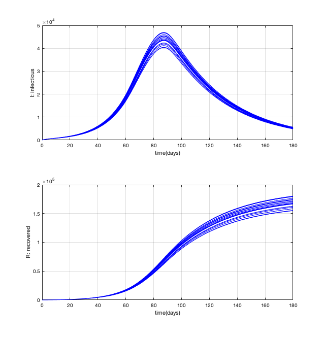
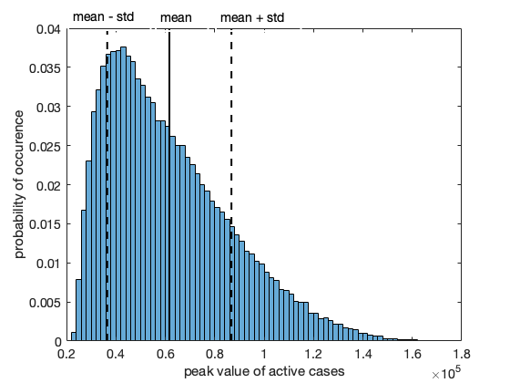

# UQ_COVID
Uncertainty quantification (UQ) on COVID ODE model

This Matlab code provides the possibility to study the effect of parametric uncertainty in a simple SEIR-model that are typically used to study the spread of a virus outbreak like COVID-19.
The SEIR model is taken from the website of Peter Forsyth (https://cs.uwaterloo.ca/~paforsyt/SEIR.html).
The UQ framework is based on UQLab (https://www.uqlab.com/).

In order to run the code, you need:
- install UQLab from https://www.uqlab.com/
- execute UQ_corona.m

The type of UQ analysis can be changed in UQ_corona.m. Options are for example Monte Carlo or Polynomial Chaos Expansion (PCE). 
In UQ_corona.m one should also indicate the case-file to be loaded (e.g. Wuhan.m). The uncertain parameters and their distributions, which are case specific, are specified in this case-file. The assumed distributions should follow the UQLab specification.
The quantity of interest is currently set to the maximum number of active cases (E+I). This can be changed by changing the output in solve_corona.m.

The output from the code is:
- mean and standard deviation of the quantity of interest
- histogram (pdf) of the quantity of interest
- Sobol indices: these indicate the sensitivity of the quantity of interest with respect to the uncertain parameters.

Example runs with the SEIR model:

Histogram of the peak in active cases, given uncertainty in all parameters:

